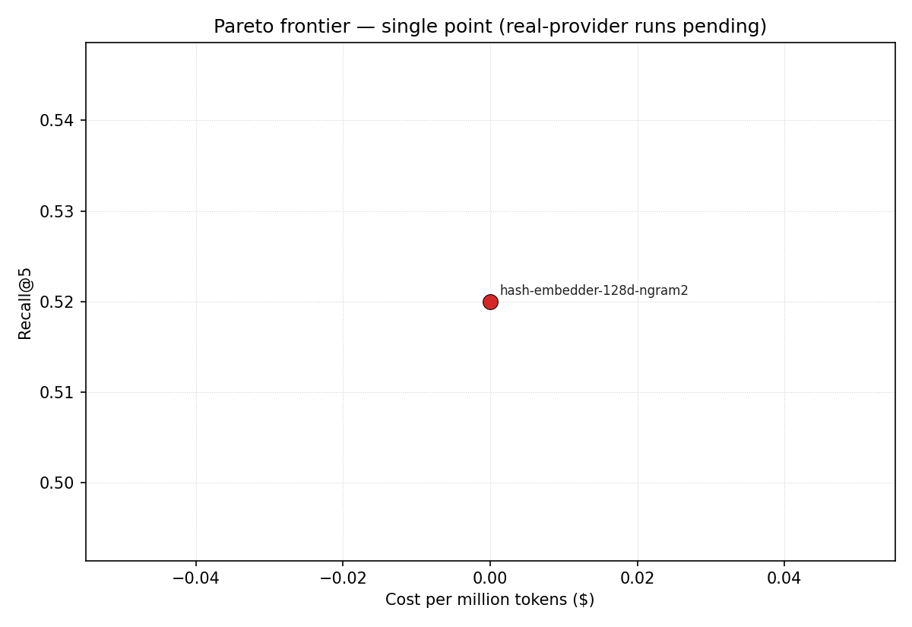

# embedding-model-shootout
> Reproducible empirical comparison of embedding models on a technical-docs corpus: recall@k, NDCG, cost per million tokens, latency, Pareto frontier.


## What this is

Picking an embedding model is one of the few choices in a RAG stack
that *directly* moves recall numbers, and the only way to make it
defensibly is to measure on a corpus that looks like yours. Most
published shootouts hide their corpus, vary their k, or quietly use a
held-out set the embedding provider trained on. This repo's bet is the
opposite: a single, publicly-licensed corpus, the same query set across
every model, and every number reproducible from a fresh clone.

The repo today ships four things, the four closed issues map to them:

1. **Corpus** ([#1], [D-002], [D-003]) — CPython standard-library
   docstrings, regenerated from `inspect` on a pinned Python version. On
   CPython 3.14 the curated module list yields **12,010 chunks**,
   comfortably above the ≥10k acceptance bar. Not committed as data;
   pinning the Python version pins the corpus.
2. **Sweep harness** ([#2], [D-004]–[D-007]) — one `Embedder` Protocol,
   one `run_sweep` function, six provider implementations. The dep-free
   `hash` baseline runs in standard CI; OpenAI / Voyage / Cohere / BGE /
   Nomic are gated behind optional extras and operator-supplied API
   keys.
3. **Pareto frontier** ([#3], [D-008]) — pure-Python frontier
   computation in `emb_shootout.pareto`, matplotlib renderer behind a
   `plot` extra. Axes fixed to cost-per-million-tokens (x) and
   recall@5 (y) per acceptance criteria.
4. **Reproducer** ([#5]) — `notebooks/reproduce.ipynb` plus the
   executable twin `notebooks/_verify.py` walk corpus → queries → hash
   baseline sweep → markdown aggregation → Pareto plot end-to-end. Five
   shape tests pin the notebook's import surface and assert no cached
   outputs ship.

What the repo does **not** yet have is a multi-provider results table.
The harness is wired for it, the queries are constructed
deterministically from the corpus at sweep time ([D-005]) so all
providers run apples-to-apples, and the operator can populate the table
in one command per provider; that's tracked in [#2]'s acceptance
criteria, but the cost and quota live with the operator, not in CI.

[#1]: https://github.com/jt-mchorse/embedding-model-shootout/issues/1
[#2]: https://github.com/jt-mchorse/embedding-model-shootout/issues/2
[#3]: https://github.com/jt-mchorse/embedding-model-shootout/issues/3
[#5]: https://github.com/jt-mchorse/embedding-model-shootout/issues/5

## Takeaways (so far)

This section is locked to `results/hash.json` by `tests/test_readme_snapshot.py`;
when more provider JSONs land in `results/`, this section gets rewritten with
those numbers and the snapshot test moves with it. Until then, only the hash
baseline is grounded by a real measurement and only its numbers are quoted.

- **The retrieval task is non-trivial even for a known-bad embedder.** The
  dep-free `hash-embedder-128d-ngram2` (a SHA-256 bag-of-character-bigrams
  projection to 128 dimensions) scores **recall@1 = 0.320**, **recall@5 =
  0.520**, **recall@10 = 0.620**, **NDCG@10 = 0.449** on the 12,010-chunk
  corpus with 50 seeded queries. Those numbers are real — they are not
  zero because the queries are verbatim snippets from each target chunk
  ([D-005]), so any embedder that preserves character n-gram overlap can
  recover roughly half of them at k=5. They are the **floor**, not a
  finding about quality.
- **What a real embedder must do to be interesting.** Recall@5 above the
  ~0.52 hash floor on this corpus comes from semantics that bag-of-bigrams
  cannot represent: paraphrase, synonymy, structural similarity. An
  embedder that does not clear the floor by a meaningful margin is, on
  this corpus, doing no better than character-overlap. That is the
  contract the real-provider runs will be evaluated against, not against
  each other in isolation.
- **The cost and latency columns are not noise.** The hash baseline
  reports a corpus embed time of **~429 ms** for all 12,010 chunks and a
  per-query p95 of **0.017 ms**, both on a laptop, both with $0/M tokens.
  Real provider runs will move those numbers by orders of magnitude; the
  Pareto plot ([#3], `docs/pareto.png`) is the place where the
  cost/quality tradeoff becomes visible — currently a single point
  ([D-008] documents the honest no-frontier rendering until a second
  point exists).
- **Methodology choices that close common shootout escape hatches.** The
  corpus is reproduced from source on a pinned Python version, not
  fetched ([D-002]); the chunk shape is one stdlib member per chunk
  ([D-003]) so chunking effects don't confound the embedding comparison;
  the query set is derived from the corpus at sweep time with a fixed
  seed ([D-005]), not pre-committed, so corpus and queries cannot drift;
  cost-per-million-tokens is recorded alongside quality per run ([D-006])
  so historical comparisons survive pricing updates; one JSON per
  provider, aggregator merges ([D-007]), so concurrent runs don't
  collide.

What this section will not say until real-provider runs are committed:
which provider wins, what the recall ceiling looks like on this corpus,
or what the Pareto frontier shape is. Those claims need data, and the
data is operator-supplied.

## Architecture

```
emb_shootout/
├── corpus.py     ← DEFAULT_MODULES + build_corpus(modules) + write_jsonl()
├── queries.py    ← #2: deterministic verbatim-snippet queries from the corpus
├── sweep.py      ← #2: Embedder Protocol + run_sweep + recall@k + NDCG + aggregator
├── providers/    ← #2: HashEmbedder (default) + OpenAI, Voyage, Cohere, BGE, Nomic
└── cli.py        ← emb-shootout corpus build / sweep run / sweep aggregate
```

The corpus loader walks each module via `inspect`, treats `__all__` as the
authoritative re-export list, emits one `Chunk` per documented member
(signature-then-docstring), deduplicates by qualname, and writes JSONL.
See [`docs/corpus.md`](docs/corpus.md) for the full chunk shape,
license, and provenance.

The sweep harness (#2) is one `Embedder` Protocol (`embed(texts) -> list[list[float]]`
plus `name`, `dim`, `cost_per_million_tokens`) and one `run_sweep(corpus,
queries, embedder)` function that embeds corpus + queries, runs cosine
top-k retrieval, and reports recall@1/5/10, NDCG@10, and embed-latency
p50/p95. The dep-free `HashEmbedderProvider` ships in the base install for
hermetic CI; the five real providers (OpenAI, Voyage, Cohere, BGE, Nomic)
are lazy-imported behind their respective optional extras and wire to
their SDKs via env vars.

## Quickstart

```bash
python3 -m venv .venv && source .venv/bin/activate
pip install -e '.[dev]'

# Build the full curated-list corpus (≥10k chunks, ~5–10s on a laptop).
emb-shootout corpus build --out data/corpus.jsonl

# Or restrict to a single module:
emb-shootout corpus build --out /tmp/just-json.jsonl --module json

# Inspect:
wc -l data/corpus.jsonl
head -1 data/corpus.jsonl | python -m json.tool
```

Tests, lint, format check:

```bash
ruff check . && ruff format --check . && pytest
```

Reproduce every committed number end-to-end (#5):

```bash
# Notebook form — open in Jupyter:
jupyter notebook notebooks/reproduce.ipynb
# Script form — runs the same steps without Jupyter, suitable for CI:
python notebooks/_verify.py
```

The notebook walks corpus → queries → hash baseline sweep → markdown
aggregation → Pareto frontier, with cell-level commentary explaining
why each step is the contract. Output cells are committed empty so a
clean re-run produces a meaningful diff. When real-provider result JSONs
land in `results/`, the notebook re-runs unchanged and absorbs them.

## Sweep harness (#2 · this PR)

```bash
# Build the corpus.
emb-shootout corpus build --out data/corpus.jsonl

# Run a provider. Hash-only (dep-free, hermetic) baseline:
emb-shootout sweep run --provider hash \
  --corpus data/corpus.jsonl --queries 200 --output results/hash.json

# Real providers each need their SDK + API key:
pip install 'emb-shootout[openai]'
OPENAI_API_KEY=sk-... emb-shootout sweep run --provider openai \
  --corpus data/corpus.jsonl --queries 200 --output results/openai.json

# Aggregate JSONs into the markdown table.
emb-shootout sweep aggregate --results-dir results --out docs/benchmarks.md
```

Six providers wired (`hash`, `openai`, `voyage`, `cohere`, `bge`, `nomic`).
The query set is derived deterministically from the corpus at sweep time
(seed `42` by default), so all providers run against the same queries by
construction — cross-provider rows are apples-to-apples.

## Benchmarks / Results

The aggregated markdown table lives at [`docs/benchmarks.md`](docs/benchmarks.md);
the cited numbers in [Takeaways (so far)](#takeaways-so-far) are pulled
from `results/hash.json` directly and locked to it by
`tests/test_readme_snapshot.py`. Real-provider rows land when the
operator runs them with their API keys and commits the resulting
`results/<provider>.json`. Per the no-fabricated-benchmarks rule, this
README does **not** carry placeholder numbers for providers that have not
been measured.

### Pareto frontier (cost vs. recall@5)



The plot above is generated from whatever lives in `results/` at commit
time by `emb-shootout sweep plot`. Today that's the dep-free hash
baseline only — one point, so the "frontier" is trivially itself and
the figure title says so honestly (no polyline, no claimed shape).

Once the operator commits `results/openai.json`, `results/voyage.json`,
etc., this same image regenerates with multiple points: every provider
plotted, the non-dominated subset highlighted in red, and a dashed
polyline drawn through the frontier when ≥2 distinct points exist. The
*frontier-selection* code (`emb_shootout.pareto.pareto_frontier`) is
pure-stdlib Python and ships in the base install; the matplotlib
*renderer* lives behind a `plot` extra (`pip install -e '.[plot]'`)
to keep the dep-free posture of the core package intact (D-008).

Regenerate locally:

```bash
emb-shootout sweep plot --results-dir results \
  --out-png docs/pareto.png --out-svg docs/pareto.svg
```

## Demo

*60-second demo pending — depends on issue [#2].*

## Why these decisions

See [`MEMORY/core_decisions_human.md`](MEMORY/core_decisions_human.md).

## License

MIT.

The corpus content itself is derived from CPython stdlib docstrings,
licensed under the [Python Software Foundation License v2][psf]. See
`docs/corpus.md` for attribution details.

[psf]: https://docs.python.org/3/license.html
[D-002]: MEMORY/core_decisions_human.md
[D-003]: MEMORY/core_decisions_human.md
[D-004]: MEMORY/core_decisions_human.md
[D-005]: MEMORY/core_decisions_human.md
[D-006]: MEMORY/core_decisions_human.md
[D-007]: MEMORY/core_decisions_human.md
[D-008]: MEMORY/core_decisions_human.md
