# Architecture

## Pipeline

```mermaid
flowchart LR
    classDef shipped fill:#dcffe4,stroke:#22863a,color:#000
    classDef opkey   fill:#fff5b4,stroke:#c69400,color:#000

    Py["CPython stdlib<br/>(pinned interpreter)"]:::shipped --> Insp["inspect-based loader<br/>emb_shootout.corpus.build_corpus()"]:::shipped
    Insp --> Chunks["Chunks<br/>(chunk_id, text, module,<br/>qualname, kind, source)"]:::shipped
    Chunks --> JSONL[("data/corpus.jsonl<br/>≥10k records<br/>(#1)")]:::shipped

    JSONL --> Queries["Held-out queries<br/>emb_shootout.queries<br/>(#2, D-005)"]:::shipped
    JSONL --> Sweep["Sweep harness<br/>emb_shootout.sweep.run_sweep()<br/>(#2, D-004)"]:::shipped
    Queries --> Sweep
    Sweep --> Hash["hash baseline<br/>results/hash.json<br/>(shipped, runs in CI)"]:::shipped
    Sweep --> Real["OpenAI · Voyage · Cohere · BGE · Nomic<br/>results/&lt;provider&gt;.json<br/>(harness ready, gated on operator API keys)"]:::opkey

    Hash --> Agg["Aggregator<br/>emb_shootout.sweep.aggregate_markdown()<br/>(#11, D-007)"]:::shipped
    Real --> Agg
    Agg --> Bench[("docs/benchmarks.md")]:::shipped

    Hash --> Pareto["Pareto frontier<br/>emb_shootout.pareto.compute_frontier()<br/>(#3, D-008)"]:::shipped
    Real --> Pareto
    Pareto --> Plot["Matplotlib renderer<br/>emb_shootout.plot<br/>(behind [plot] extra)"]:::opkey
    Plot --> PNG[("docs/pareto.png<br/>(committed when ≥2 points exist)")]:::opkey

    JSONL --> Notebook["notebooks/reproduce.ipynb<br/>+ notebooks/_verify.py<br/>(#5)"]:::shipped

    classDef _legend stroke-dasharray:3 3
```

Green nodes ship today and run in CI on every PR. Yellow nodes are wired
end-to-end but the data is operator-supplied: the paid-provider sweeps
need an API key, and the matplotlib Pareto renderer needs `pip install
'.[plot]'` plus a second non-`hash` result so the frontier has more than
one point to draw (D-008 documents the honest no-frontier rendering
until that second point exists).

## Components shipped

- **`emb_shootout.corpus`** — `build_corpus(modules)` returns a generator
  over `Chunk` records; `DEFAULT_MODULES` is the curated stdlib list
  (#1). `write_jsonl(chunks, path)` is the deterministic JSONL writer.
- **`emb_shootout.queries`** — derives the held-out query set from the
  corpus at sweep time with a fixed seed (D-005). No pre-committed
  queries; corpus and queries cannot drift apart.
- **`emb_shootout.sweep`** — `Embedder` Protocol, `run_sweep(provider,
  corpus, queries)`, `aggregate_markdown(results_dir)`. One JSON per
  provider (D-007), aggregator is pure-read so concurrent operator runs
  don't collide.
- **`emb_shootout.providers`** — six implementations: the dep-free
  `hash-embedder-128d-ngram2` baseline that runs in CI on every PR, plus
  OpenAI / Voyage / Cohere / BGE / Nomic behind optional extras
  (D-004). Each is exercised by its own unit test against a stub HTTP
  response shape, so the wire format is locked even when no API key is
  configured.
- **`emb_shootout.pareto`** — pure-Python `compute_frontier(points)`
  over (cost-per-million, recall@5) pairs (D-008). The frontier
  computation is dep-free so it runs in the standard CI matrix.
- **`emb_shootout.plot`** — matplotlib renderer behind the `plot`
  extra. Frontier computation is upstream of rendering; if `plot`
  isn't installed, the frontier is still computable as JSON.
- **`emb-shootout`** — argparse CLI: `corpus build`, `sweep run`,
  `sweep aggregate`, `pareto plot`. Each subcommand has a `--help`
  surface; the public-surface lock (#13, `tests/test_public_surface.py`)
  pins the top-level package's `__all__` and the CLI entry-point in
  `pyproject.toml`.
- **`notebooks/reproduce.ipynb`** + **`notebooks/_verify.py`** —
  walk corpus → queries → hash baseline sweep → markdown aggregation
  → Pareto plot end-to-end (#5). Five shape tests pin the notebook's
  import surface and assert no cached outputs ship.
- **`scripts/capture_demo.sh`** — three-surface 60-second demo driver
  for the README's Demo section (#15). Single-module corpus, single
  provider (hash), deterministic. `tests/test_capture_demo_smoke.py`
  runs it in CI with `CAPTURE_PACE_SECONDS=0`.

## Locked outputs

These outputs are checked at the byte level by snapshot tests so they
can't drift from the code that produces them:

- **`docs/benchmarks.md`** — `tests/test_benchmarks_md_snapshot.py`
  rebuilds the table by calling `aggregate_markdown(results/)` and
  byte-compares to the committed file. Belt-and-braces with the
  README "Takeaways" section locked by `tests/test_readme_snapshot.py`
  (#4).
- **`results/hash.json`** — committed; the in-CI baseline so the
  aggregator and snapshot tests have at least one real result to
  exercise.
- **README "Takeaways"** — locked to `results/hash.json` (#4).

## What's still operator-supplied

- Paid-provider sweeps (OpenAI / Voyage / Cohere / BGE / Nomic).
  The acceptance criterion for #2 had two parts: the harness, and the
  numbers. The harness shipped; the numbers cost real money and live
  with the operator, not in CI.
- A two-point Pareto frontier rendered as `docs/pareto.png`. Needs
  one real-provider result alongside `results/hash.json`. The
  frontier computation in `emb_shootout.pareto` is ready; the
  matplotlib renderer is behind the `[plot]` extra.
- The captured 60-second walkthrough GIF/video (#16) — `tools/`
  isn't where this repo's capture script lives; it's
  `scripts/capture_demo.sh` (#15) and the binary recording is the
  operator's step.

## Related decisions

D-002 (corpus reproduced from source on pinned Python, not fetched),
D-003 (one stdlib member per chunk, so chunking effects don't confound
embedding comparison), D-004 (provider extras gate dep weight on the
default install), D-005 (queries derived from corpus at sweep time),
D-006 (cost-per-million recorded alongside quality), D-007 (one JSON
per provider, aggregator merges), D-008 (Pareto axes fixed to
cost-per-million × recall@5), D-009 (atomic write helpers live in a
package-level `emb_shootout.io_utils` module so `cli.py`, `corpus.py`,
and the notebook builder share one tempfile-+-rename writer).
