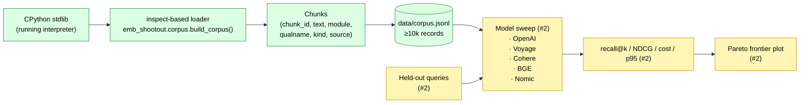

# Architecture

## Shipped (this PR — issue #1)

## Components shipped

- **`emb_shootout.corpus.DEFAULT_MODULES`** — curated list of ~140
  stdlib modules. The list is the corpus's only configuration.
- **`build_corpus(modules)`** — generator over `Chunk` records. Skips
  unimportable modules silently (e.g., `readline` on Windows) so a
  Windows reproduction doesn't fail; the set of skipped modules
  surfaces in the CLI's JSON summary.
- **`write_jsonl(chunks, path)`** — deterministic JSONL writer.
- **`emb-shootout corpus build`** — argparse CLI entry point.

## Pending

- **Issue #2:** the actual model sweep. Five embedders, the same
  technical-docs query set, recall@1/5/10, NDCG@10, cost per million
  tokens, p95 latency. Results land in `results/*.json`; Pareto plot in
  `docs/benchmarks.md`.
- Query-set construction methodology will be locked when #2 ships
  (current plan: mine questions from real Python user activity against
  expected answer modules — exact methodology decided in #2).
